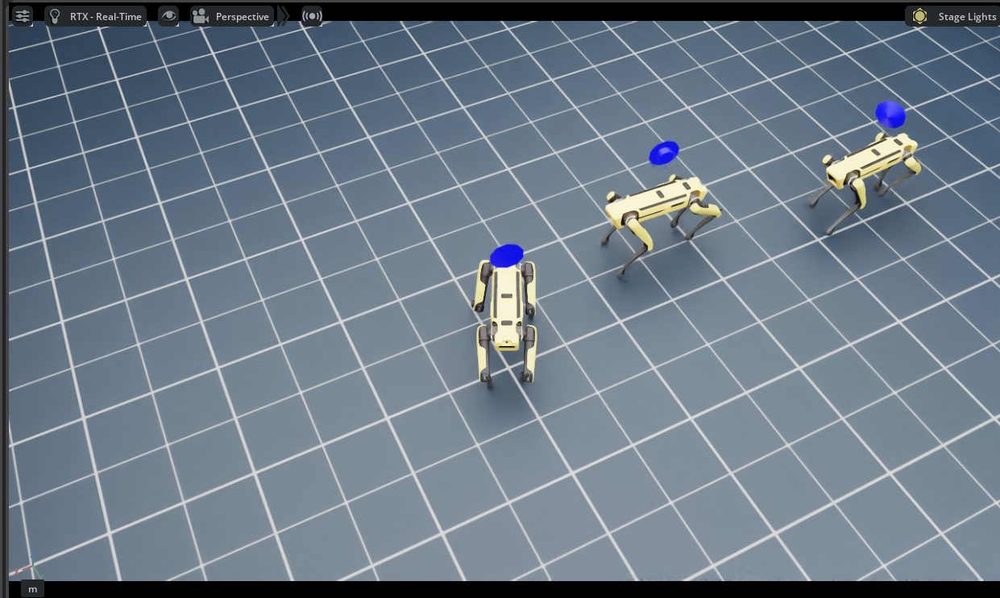

#  Isaac Sim Unitree Go2/Spot ROS2
[](https://docs.python.org/3/whatsnew/3.10.html)
[](https://docs.ros.org/en/humble/index.html)
[](https://docs.isaacsim.omniverse.nvidia.com/4.5.0/index.html)
[](https://isaac-sim.github.io/IsaacLab/main/index.html)
[](https://releases.ubuntu.com/22.04/)

Unitree Go2 の Isaac-Sim(4.5.0) と IsaacLab(2.1.0-1) 向けシミュレーションリポジトリへようこそ。本リポジトリは [Migration Guide](https://isaac-sim.github.io/IsaacLab/main/source/migration/migrating_from_orbit.html) に従って最新の NVIDIA ライブラリを利用するよう更新され、複数のデバイスで検証済みです。

 


## 更新:
- Isaac-Sim 5.0.0 と IsaacLab 2.2.0 は ```Python 3.11``` をサポートします。ただし、ROS Humble を使用する Ubuntu 22.04 は ```Python 3.10```、ROS2 Jazzy の Ubuntu 24.04 は ```Python 3.12``` をベースにしており、それにより rclpy のエラーが生じる場合があります。[バグ報告を読む](https://github.com/isaac-sim/IsaacLab/issues/3129)

- Spot がリポジトリに追加されました。現在は Spot と Go2 の両方をフル機能で使用できます。
- ros-mcp-server は任意のタイプのロボットとの統合を容易にするよう更新されました。
  (**注:** 私の実装はソースリポジトリのものとは異なります。詳細は謝辞 (Acknowledgement) を参照してください)
- ros-mcp-server にさらに更新が入り、グラフベースの可視化を備えたウェブポータルが追加され、ros トピックやサービスの確認が非常に簡単になりました。詳細は「MCP LLM and Web Portal Usage」を参照してください。
  
---

## 目次
1. [インストールガイド](#1-インストールガイド)  
2. [Unitree Go2/Spot シミュレーションの実行](#2-unitree-go2spot-シミュレーションの実行)  
3. [ROS2 トピックと可視化](#3-ros2-トピックと可視化)  
    - [コマンドと制御](#31-コマンドと制御)  
    - [前方カメラ](#32-前方カメラ)  
    - [LIDAR（ライダー）](#33-lidarライダー)  
    - [オドメトリと位置推定](#34-オドメトリと位置推定)  
4. [シミュレーション環境と設定](#4-シミュレーション環境と設定)
    - [異なるロボットの起動](#41-異なるロボットの起動)
    - [異なるシミュレーション環境の起動](#42-異なるシミュレーション環境の起動)  
    - [異なるポリシー/アルゴリズムの起動](#43-異なるポリシーアルゴリズムの起動)  
    - [カスタムチェックポイントの読み込み](#44-カスタムチェックポイントの読み込み)  
    - [複数ロボットを環境で起動する](#45-複数ロボットを環境で起動する)  
    - [Yolo 設定の変更](#46-yolo-設定の変更)  
5. [MCP LLM とウェブポータルの利用方法](#5-mcp-llm-とウェブポータルの利用方法)  
6. [謝辞](#6-謝辞)  


---

## 1. インストールガイド
**ステップ I:** 最新の Isaac Sim と Isaac Lab をインストールするには、公式ドキュメント [Isaac Lab official documentation](https://isaac-sim.github.io/IsaacLab//v2.1.1/source/setup/installation/index.html) に従ってください。

**ステップ II:** 公式インストールガイドに従って [ROS2 Humble](https://docs.ros.org/en/humble/index.html) をインストールしてください。

**ステップ III:** conda 環境に必須の C 拡張をインストールします。
```
# Assuming you are using default conda env name from IsaacLab (env_isaaclab)
conda activate env_isaaclab     
conda install -c conda-forge libstdcxx-ng
```

**ステップ IV:** このリポジトリをローカルにクローンします。
```
git clone https://github.com/sallu-786/Go2_Isaac_ros2/
```

**ステップ V:** コンピュータビジョン関連の依存関係をインストールします
```
conda activate env_isaaclab  
pip install -r requirements.txt
```

## 2. Unitree Go2/Spot シミュレーションの実行 
シミュレーションを実行するには、次のコマンドを使用してください:
```
cd ~/Go2_Isaac_ros2
python main.py
```
シミュレーションが読み込まれると、キーボードでロボットをテレオペレーションできます:

```W```: 前進、```A```: 左、```S```: 後退、```D```: 右、```Z```: 左回転、```C```: 右回転。

独自のカスタムキーを設定するには、[go2_ctrl.py](<quadruped/go2/go2_ctrl.py>)/[spot_ctrl.py](<quadruped/spot/spot_ctrl.py>) を変更してください。


## 3. ROS2 トピックと可視化
シミュレーションを起動した後、新しいターミナルを開き、Rviz2 で ROS2 データを可視化します:
```
cd ~/Go2_Isaac_ros2/rviz/
rviz2 -d go2.rviz         #use spot.rviz for spot
```

次のように表示されるはずです


何も表示されない場合は、「Add」ボタンをクリックし、トピックリストから表示したいトピックを選択してください。環境内に複数のロボットがいる場合は、手動で rviz にトピックを追加する必要があります。


以下は Unitree Go2 と Spot に利用可能な ROS 2 トピックのカテゴリ別リストです。


**注:** Spot を使用している場合、`spot_0` の代わりに `unitree_go2_0` が表示されます。<**0**> はインデックスを示し、複数ロボットが存在する可能性があることを意味します。

### 3.1 コマンドと制御  
- `/unitree_go2_0/cmd_vel`: ロボットの運動制御のために速度コマンドを送るトピックです。

### 3.2 前方カメラ 
- `/unitree_go2_0/front_cam/color_image`: RGB カラー画像を配信します
- `/unitree_go2_0/front_cam/depth_image`: 深度画像を配信します
- `/unitree_go2_0/front_cam/semantic_segmentation_image_vis`: セマンティックセグメンテーション画像を配信します
- `/unitree_go2_0/front_cam/info`: カメラ情報（内パラメータなど）を配信します
- `unitree_go2_0/front_cam/detection_image`: Yolo ベースの物体検出を施した画像を配信します

### 3.3 LIDAR（ライダー）  
- `/unitree_go2_0/lidar/point_cloud`: ロボットの LIDAR センサで生成されたポイントクラウドを配信します。

### 3.4 オドメトリと位置推定  
- `/unitree_go2_0/odom`: ロボットの位置、姿勢、速度を含むオドメトリデータを配信します。
- `/unitree_go2_0/pose`: ワールドフレームにおける現在のロボットのポーズを配信します。


## 4. シミュレーション環境と設定
シミュレーション環境と設定は [sim.yaml](<cfg/sim.yaml>) の設定ファイルで変更できます。 

### 4.1 異なるロボットの起動
 ロボットを変更するには、[sim.yaml](<cfg/sim.yaml>) の `robot` の値を変更してください。現在は Spot と Go2 が利用可能です。
 現時点では同時に両方を選択することはできません。

 例えば、Spot を 3 台スポーンする例

    

### 4.2 異なるシミュレーション環境の起動
現在の実装には、USD 環境（クラウドからの）をインポートする標準的な Isaac Sim の方法に従った複数の環境が含まれています。環境を変更するには、[sim.yaml](<cfg/sim.yaml>) の `env_name` を変更してください。現在利用可能な環境:
- `warehouse`: Isaac Sim のシンプルな倉庫環境（warehouse カテゴリのさらなるオプションについては [sim_env.py](<env/sim_env.py>) 内の関数のパス値を変更してください）
- `obstacle`: 障害物フィールド環境。（密にするか疎にするかは [sim_env.py](<env/sim_env.py>) の `num_obstacles` 変数を変更してください）
- `terrain`: Isaac Sim の地形環境。（terrain カテゴリのさらなるオプションは `create_terrain_env()` 関数内のパス値を変更してください）
- `office`
- `hospital`
- `rivermark`

現時点で isaac-sim 4.5.0 には 70 の環境アセットがあります。詳細は [Environment Assets](https://docs.isaacsim.omniverse.nvidia.com/4.5.0/assets/usd_assets_environments.html) を参照してください。
  
### 4.3 異なるポリシー/アルゴリズムの起動 
デフォルト（`ActorCritic`）以外のポリシーを起動するには、[go2_ctrl_cfg.py](<go2/go2_ctrl_cfg.py>)/[spot_ctrl_cfg.py](<quadruped/spot/spot_ctrl_cfg.py>) を参照し、次のいずれかの値を使用してください:
  - `ActorCriticRecurrent`
  - `StudentTeacher`
  - `StudentTeacherRecurrent`

アルゴリズムはデフォルトで `PPO` です。`Distillation` も使用できます。互換性の確認や詳細については [API_docs](https://isaac-sim.github.io/IsaacLab/main/source/api/lab_rl/isaaclab_rl.html) を参照してください。

### 4.4 カスタムチェックポイントの読み込み

フラットおよびラフ地形向けの事前学習済みモデル（ポリシーファイル）は `ckpts/unitree_go2` フォルダにあります。独自のポリシーをロードしたい場合は、ファイルをフォルダに置き、[go2_ctrl_cfg.py](<go2/go2_ctrl_cfg.py>)/[spot_ctrl_cfg.py](<quadruped/spot/spot_ctrl.py>) の `load_checkpoint` の値を変更してください。

### 4.5 環境内で複数ロボットを起動する
このリポジトリは複数の Unitree Go2 ロボットの実行をサポートしており、ロボット数は設定ファイル [sim.yaml](<cfg/sim.yaml>) の `num_envs` パラメータで変更できます。

### 4.6 Yolo 設定の変更
Yolo モデルは [yolo](<yolo>) フォルダに配置する必要があります。クラス分類の信頼度閾値は **0.7** に設定されています。モデルと信頼度の値をカスタマイズするには、[go2_ros2_bridge.py](<ros2/go2_ros2_bridge.py>)/[spot_ros2_bridge.py](<ros2/spot_ros2_bridge.py>) 内の `self.model` と `self.confidence_threshold` を変更してください。


## 5. MCP LLM とウェブポータルの利用方法
ロボットは、LLM に自然言語コマンドを与えるかウェブポータルを介して制御できます。さらに、インストールなしで他者と共有することも可能です。詳細は [README_MCP](<ros-mcp-server/README_MCP.md>) を参照してください。


## 6. 謝辞
本リポジトリは [isaac-go2-ros2](https://github.com/Zhefan-Xu/isaac-go2-ros2) の作業に基づいて構築されています。

Go2 コントローラは [go2_omniverse](https://github.com/abizovnuralem/go2_omniverse) に実装された RL コントローラに基づいています。

MCP コントロールは [ros-mcp-server](https://github.com/lpigeon/ros-mcp-server) に基づいています。

## 7. 引用
```
@MISC{Suleman2025,
  author = "Muhammad Suleman",
  title = "Unitree Go2 in Isaac-Sim",
  year = "2025",
  url = "https://github.com/sallu-786/Go2_Isaac_ros2",
  note = "Version 1.2.1"
}
```
## 8. 連絡先
suleman.muhammad@toyota-boshoku.com
